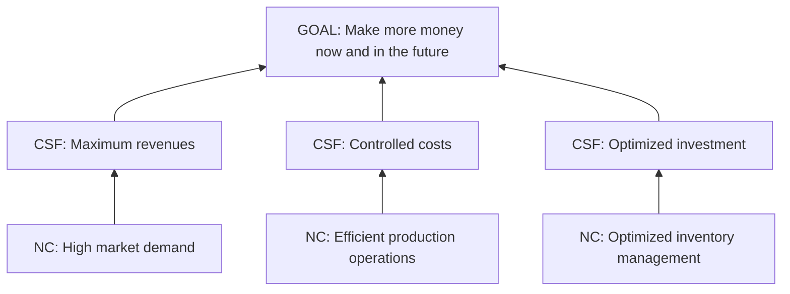
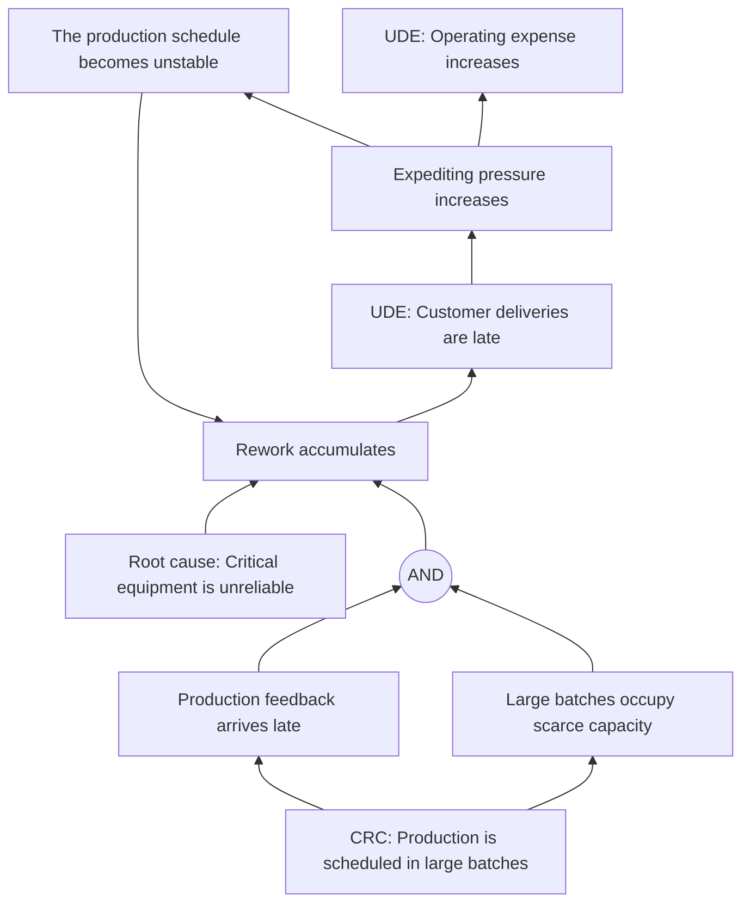
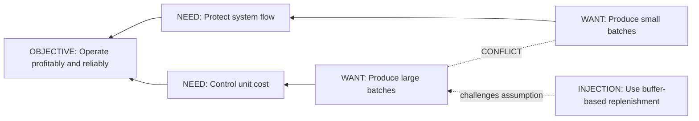
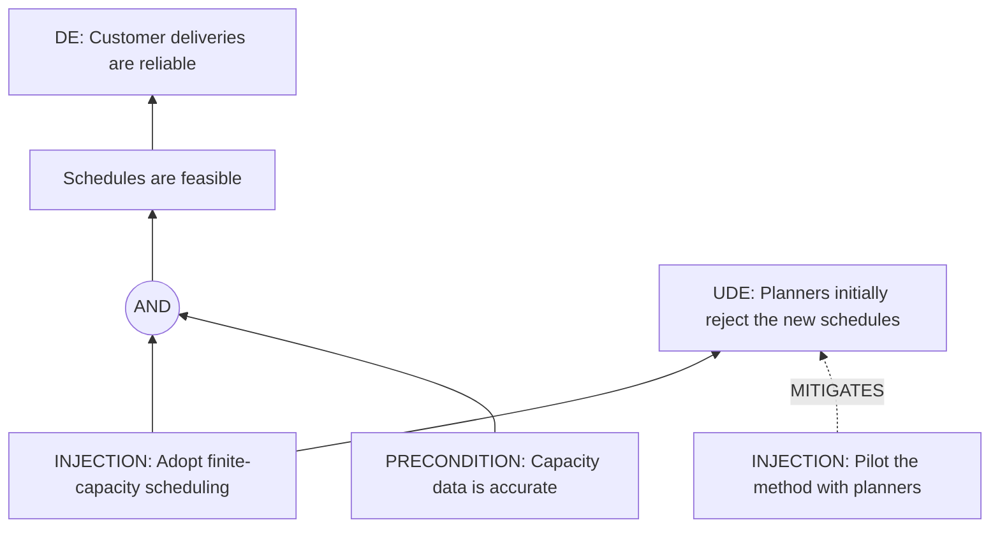

# Semantic Oracle Review

Fecha: 2026-07-16.

Objetivo: validar el significado de los cuatro oraculos de Gate B antes de
iniciar `3C.14a`. Los diagramas no fijan posiciones ni apariencia final; fijan
entidades, argumentos, junctions y verbalizaciones.

## 1. Goal Tree

Lectura clave: para alcanzar el Goal debemos tener los tres CSF. Las entradas
son `AND` implicito de necesidad; no aparece un junctor.

Validar:

- Los tres CSF son condiciones necesarias, no alternativas.
- Una flecha se lee desde la condicion hacia el objetivo soportado.
- Goal Tree no necesita junctions de suficiencia.

## 2. Current Reality Tree

Lecturas clave:

- Capacity y feedback producen rework conjuntamente mediante `AND`.
- Equipment e instability son causas independientes adicionales de rework.
- Los tres argumentos entrantes se agregan como `OR` implicito.
- Rework, delivery, pressure e instability forman un loop negativo.

Assumptions oraculo:

- El conjunto capacity + delayed feedback genera trabajo que debe repetirse.
- Scarce capacity impide absorber el trabajo incompleto en otro lugar.

Validar:

- El `AND` expresa dependencia conjunta y no simple simultaneidad.
- Las causas independientes no necesitan un junctor `OR`.
- El loop conserva todas las flechas semanticas aunque Layout rompa una
  temporalmente para calcular capas.

## 3. Evaporating Cloud

Lecturas clave:

- Ambos needs son necesarios para el objetivo.
- Cada want es percibido como necesario para su need.
- `CONFLICT` no es `XOR`: puede proceder de una restriccion contextual.
- La injection desafia la assumption de que solo large batches controlan coste.

Assumptions oraculo:

- Protecting flow es indispensable para el objetivo.
- Controlling unit cost es indispensable para el objetivo.
- Solo small batches pueden proteger flow.
- Solo large batches pueden controlar unit cost.
- El recurso no puede producir small y large batches al mismo tiempo.

Validar:

- Objective, needs y wants ocupan sus roles canonicos.
- El conflicto reside entre wants, no entre needs.
- Una injection es una propuesta hasta que FRT la valida.

## 4. Future Reality Tree

Lecturas clave:

- Scheduling y accurate data son conjuntamente suficientes para feasible
  schedules.
- La misma injection abre una negative branch hacia resistance.
- Pilot with planners se registra como mitigacion propuesta, no como una flecha
  positiva que causaria resistance.

Validar:

- Una injection sigue siendo hipotesis mientras su derivacion esta `PROPOSED`.
- La UDE pertenece a una negative branch del FRT.
- Mitigar una UDE no debe verbalizarse como causarla.

## Decisiones de aprobacion

Gate B puede considerarse metodologicamente validado cuando:

1. Las cuatro lecturas anteriores son correctas.
2. `AND`, OR implicito, `MAG` y `XOR` tienen significados distintos.
3. `CONFLICT` permanece separado de `XOR`.
4. Assumptions pueden pertenecer al argumento o a un tramo concreto.
5. Injection, mitigation y validation conservan estados explicitos.

Las correcciones se aplicaran primero a los fixtures y despues al contrato. No
se adaptara el fixture para hacer pasar una implementacion ya escrita.

## 5. Microcasos de operadores

| Operador | Lectura | Representacion |
| --- | --- | --- |
| `SIMPLE` | Una premisa forma un argumento independiente. | Flecha directa, sin junctor. |
| `AND` | Todas las premisas del grupo son necesarias para que el argumento sea suficiente. | Junctor explicito. |
| `OR` | Cualquiera de las premisas del grupo basta dentro del mismo argumento. | Junctor explicito solo al agrupar alternativas. |
| `MAG` | Varias premisas producen el efecto por acumulacion cuantificada. | Junctor explicito con magnitud o umbral en todas sus entradas. |
| `XOR` | Exactamente una alternativa del grupo puede sostener el argumento. | Junctor explicito; no se infiere de un conflicto EC. |

Composiciones que debe preservar el kernel:

- `A OR (B AND C)`: dos argumentos independientes llegan al destino; el segundo
  contiene un junctor `AND`.
- `A AND (B OR C)`: el destino de necesidad exige dos argumentos; el segundo
  contiene un junctor `OR`.
- Una coleccion de flechas directas no se fusiona en una unica relacion: cada
  argumento mantiene su ID, assumptions y ciclo de vida.

Los microfixtures validos e invalidos que fijan estas reglas estan en
`semantic-contract/v0.1/microfixtures.json` y se ejecutan con
`npm run test:semantic`.
